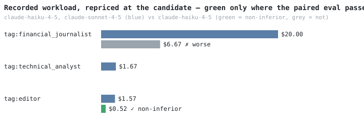

# ctrlrtn

[](https://github.com/arnovich/ctrlrtn/actions/workflows/ci.yml)

`ctrlrtn` is a **lightweight, self-hosted, drop-in proxy** for common LLM SDKs
providing better observability, caching, A/B testing and adaptive routing with a focus on agentic workflows.

## Quickstart

Needs [uv](https://docs.astral.sh/uv/) and git. Not on PyPI yet:

```bash
git clone https://github.com/arnovich/ctrlrtn && cd ctrlrtn
uv venv && uv pip install -e .

uv run ctrlrtn serve
```

To get going, point your app at the local server on `http://127.0.0.1:4000`
instead of its normal LLM provider.

By default, client credentials are used only for the forwarded provider call and
are redacted from persisted traces. A named provider can instead own a credential
from its environment; that replaces client credentials only for that upstream.


Three optional headers sharpen everything downstream: `x-ctrlrtn-task` (one id
per job — evals cluster by it), `x-ctrlrtn-route` (a stable name per agent role —
becomes the use-case key), and `x-ctrlrtn-session` (an operator-defined spend
boundary). Then:

```bash
uv run ctrlrtn usecases         # spend per discovered use-case
uv run ctrlrtn sessions         # spend per x-ctrlrtn-session value
uv run ctrlrtn spend            # total and today's recorded spend
uv run ctrlrtn budget           # ceilings, remaining spend, and blocks
uv run ctrlrtn prune --older-than-days 30  # retention dry run
uv run ctrlrtn dataset create tag:editor dataset.json  # lineage only
uv run ctrlrtn recommendations  # where a cheaper model is worth testing
uv run ctrlrtn console          # or watch it live
uv run ctrlrtn workflow diagram TASK  # export a Mermaid execution graph
uv run ctrlrtn workflow recommendations # inspect optimization candidates
uv run ctrlrtn workflow discover       # cluster recurring legacy task graphs
```

Trace retention is explicit. `prune` reports the old request/response payloads
it would clear and changes nothing unless `--apply` is supplied. Applying a
prune retains derived usage, cost, routing, experiment, task, and workflow
metrics, while clearing query strings, headers, and bodies; inferred workflow
edges whose evidence used those payloads are invalidated. Payloads frozen by
queued or running offline jobs are protected until those jobs finish.
After stopping all gateway and worker processes, `--apply --compact` additionally
requires an exclusive router maintenance lock, checkpoints WAL, and runs
`VACUUM` to reclaim the live database file.

`ctrlrtn workflow erase-task TASK` previews transitive database erasure;
`--apply` removes the task's traces, workflow/tool events, inferred edges, and
outcomes. Active jobs protect their source task. User-exported diagrams and
evidence files remain operator-owned artifacts and must follow the same policy.

Held-out evaluation starts with an inert dataset manifest, not a training
export. `dataset create` freezes exact trace IDs and payload hashes, keeps whole
task clusters on one side of the train/evaluation boundary, and exports no
prompts, responses, or raw task IDs. `dataset verify` rechecks the manifest
digest, partition semantics, and live payload bindings before use.

Use the held-out partition directly with
`replay-eval ... --dataset-manifest dataset.json`. The evaluator refuses
`--limit`, verifies the full manifest and live payloads before planning, selects
only evaluation clusters, and records the manifest digest in foreground evidence
or the durable job. Workers recheck selected payload hashes before any paid call.

For explicit agentic graphs, wrap the same run with
`sdk.edition(workflow=..., workflow_version=...)` and each logical operation
with `run.step(...)`. The SDK propagates stable step identity, causal run IDs,
dependencies, attempts, and lifecycle events; see
[`docs/workflow-identity.md`](docs/workflow-identity.md).
The console also lists recent workflow executions and opens a provenance-aware
step timeline; explicit dependencies remain distinct from inferred links.
The same detail includes evidence-labelled, read-only optimization candidates;
it never rewrites or schedules application steps.

Optional budgets block subsequent calls at a global/use-case UTC-day ceiling or
an `x-ctrlrtn-session` lifetime ceiling. Unknown cost is never treated as zero;
`free: true` marks an entire provider as zero-cost. The `budget` command shows
configured safeguards beside persisted known spend and unknown-price/block
counts. A lower per-use-case threshold may use a candidate explicitly approved
from a `NON_INFERIOR` replay artifact; the hard ceiling still blocks, and absent
or stale evidence never guesses. Optional in-flight reservations close the
concurrent-admission race by holding a conservative request estimate until its
trace is persisted. The console shows the same budget status live above its
traffic graphs. See `docs/configure.md` for the YAML shape and precise guarantee
boundary.

## A real run: which roles tolerate the cheap model — and which don't

[gimle-hugin](https://github.com/arnovich/gimle-hugin)'s multi-agent
newspaper, a few dozen editions of real traffic recorded, each Sonnet role
shadow-replayed on Haiku and judged blinded against the source data:



| role | calls | recorded cost | at candidate prices | saving | replay verdict |
| --- | ---: | ---: | ---: | ---: | --- |
| tag:financial_journalist | 452 | $20.00 | $6.67 | +67% | ✗ worse — **refused** |
| tag:technical_analyst | 231 | $1.67 | — | — | already on Haiku |
| tag:editor | 105 | $1.57 | $0.52 | +67% | ✓ non-inferior |

- **editor: switch.** Mean diff +0.07 (lower bound −0.09) — indistinguishable
  from Sonnet at 15× lower price.
- **journalist: keep Sonnet.** Mean diff **−1.18** (lower bound −1.75) —
  Haiku's articles fail against the market data they cite. The tempting
  $13/batch "saving" is exactly the switch the router exists to refuse — so
  the aggregate here is only **$1.04 of $23.23 (4%)**, and that's the point:
  the verdict is per role, and it differs.

(Method: 40 pairings/role over 20+ independent editions, blinded
position-swapped judging by claude-opus-4-8, paired non-inferiority test,
1.0-point margin, 95% one-sided. An earlier judge that saw only the
*instruction* passed the journalist — giving it the source data flipped the
verdict. Repricing assumes the same token mix, an upper bound. Table and
chart are generated: reproduce on your own workload with `docs/campaign.md`.)

## The loop: evaluate → A/B → switch

**1. Offline eval** — shadow-test a candidate on recorded inputs; no
production traffic at risk. Bills your key; dry-runs first, spends with
`--yes`:

```bash
uv run ctrlrtn replay-eval <use-case> <candidate-model> --margin 1.0
```

Offline, shadow, and live-split experiments can target an exact stable step with
`--workflow NAME --workflow-version REV --step STEP`. Step-scoped evidence is
reported only as step evidence; it is not promoted to a whole-workflow claim.

The verdict is only as good as the judge — check it against yourself:
`calibration-set` writes blinded A/B pairs, you score them 0–10 by hand,
`calibrate` reports whether the judge agrees with you (agreement with a
Wilson bound, gap compression, pro-candidate bias). Advisory and
point-in-time.

**2. Live A/B** — a 50/50 split on real traffic, judged by your app's own
outcomes (per finished task, POST `{"task_id": ..., "success": true,
"score": 0.9}` to `/ctrlrtn/outcome`):

```bash
uv run ctrlrtn experiment start tag:editor claude-haiku-4-5 --split 50
uv run ctrlrtn experiment status <id>   # tripwire; a safe verdict prints
                                             # the route adopt command
```

For a no-user-exposure trial, run an online **shadow** first. The actual
response is served unchanged while a sampled copy runs against the candidate in
an isolated, bounded background pool:

```bash
ctrlrtn shadow start tag:editor qwen2.5:7b --provider ollama --sample 10
ctrlrtn shadow list   # submitted / completed / failed / dropped
ctrlrtn shadow stop <shadow-id>
```

Actual and candidate traces share a durable pair id. Queue saturation and
provider failures are counted as attrition instead of disappearing. A live split
and shadow cannot run simultaneously on one use-case. Shadowing sends live data
to the candidate provider and bills its credentials; candidate output is
recorded but never returned to the user. The console status bar shows aggregate
running-shadow progress.

For an OpenAI-compatible candidate on another configured provider, name it
explicitly; the router switches both model and upstream on the candidate arm:

```bash
uv run ctrlrtn experiment start tag:editor qwen2.5:0.5b \
  --provider ollama --split 50
```

Cross-provider serving requires matching APIs (for example OpenAI → Ollama's
OpenAI-compatible `/v1` surface). The router rejects incompatible API shapes;
it does not translate Anthropic requests into OpenAI requests. On a provider
switch, baseline credential headers and query parameters are removed. Local
Ollama needs no replacement credentials; authenticated candidates can use a
provider-owned environment credential.

**3. Switch** — a **route** serves the model to 100% of the use-case's
traffic (precedence: running experiment > route > pass-through). The router
never switches by itself — it recommends, you decide:

```bash
uv run ctrlrtn route adopt <experiment-id>   # stop the A/B, serve its candidate
uv run ctrlrtn route list    # every switch: was -> now · since · realized saving
uv run ctrlrtn route clear tag:editor        # rollback
```

`route list` prices the calls the route actually swapped at the old model,
minus actual spend — realized savings, not projections. Notes: `max_tokens`
above the routed model's cap is clamped (warned at `route set`); routes have
no per-task runaway ceiling, so watch outcomes in the console after
switching. The whole loop, scripted end to end: `docs/campaign.md`.

**Version the control plane** — routes and running live experiments can be
declared in a committed `routing.yaml` and activated atomically:

```bash
cp routing.example.yaml routing.yaml
$EDITOR routing.yaml
git add routing.yaml && git commit -m "Update model routing"
ctrlrtn routing-config validate routing.yaml
ctrlrtn routing-config diff routing.yaml
ctrlrtn routing-config activate routing.yaml
ctrlrtn routing-config status
```

Activation requires a tracked, clean file, records the Git revision and file
SHA-256 in SQLite, and retains the last known-good state on failure. The file is
authoritative for routes and running experiments; traces, historical experiments,
jobs, and results remain runtime data in SQLite. Never store credentials or raw
recordings in the configuration repository. See `docs/configure.md` for details.

## Console

Press **F2** to investigate the current table window in a focused view:
overview, full-width role costs, task completion, and optional attached replay
evidence. Select a role or task and press Enter to inspect its chronological
calls. The view keeps unknown costs and missing/conflicting outcomes visible;
it reads at most the latest 10,000 eligible calls and labels partial totals.
Keys `1`–`4` change sections, `r` refreshes, and Escape returns to the monitor.
The [recorded newspaper demo](docs/newspaper-demo-rehearsal.md) opens directly
in this view with its verified editor comparison attached.

A live TUI over the serve database: durable offline jobs, experiments, use-cases,
spend split by the model actually served (watch an A/B shift traffic), tasks,
and a `tail -f` call feed — plus traffic graphs (calls/cost/latency/tokens,
last 30 min by default; `w` picks another window from
10m/30m/1h/6h/12h/1d/7d/all)
and a detail pane that shows tripwire verdicts with their
`route adopt` recommendation, per-use-case model breakdowns with route
savings, and full traces.

Under the four graphs runs one shared time axis — they all cover the same x
range — marking the window's start, its midpoint and `now`, in clock times or
dates depending on the span. Each graph's caption carries its peak bucket and
what one bucket is worth (`peak 12/10s`), since a tall bar means nothing
without knowing how much time it stands for.

The use-case, model and task tables span all recorded history by default and
carry their own window, picked with `t` from the same list; each
heading names the span it covers. Jobs, experiments, shadows, canaries and
workflows are lifecycle lists and are never windowed — an experiment that took
no traffic in the window must still be visible — and the call feed stays a
tail.

The three lists that grow without bound — jobs, workflows and the call feed —
page 50 rows at a time with `[` and `]` on the focused pane; the heading shows
the range and which directions have more (`Calls (live) · ‹ 51–100 ›`). Paging
off the newest page pauses the feed's tail so an older page holds still, and
returning to page 1 resumes it.

Budget status starts compact so the graphs and selected record have room.
Press `b` to expand all budget diagnostics or return to the compact summary;
both views refresh from the same snapshot. The main screen also lists the
offline, live A/B, shadow and adoption shortcuts. See
[operating with an agent](docs/agent-router-operations.md) for the shared
CLI/TUI experiment loop and the planned Hugin integration.

Every dialog is keyboard-first: `esc` closes it (no Cancel button to tab
past), `↑`/`↓` walk the fields, and the offline replay form completes as you
type — use-cases from recorded traffic, models from the price table plus
anything actually served. Completion, not a closed list: a candidate you have
never run is the normal case, so anything typed is accepted, and a line under
the field shows what matches ("news" finds `tag:newspaper_editor`).

`enter` on a row opens it: the detail pane takes the whole right-hand column
(the status lines and graphs stand aside, the sidebar does not move) and takes
focus, so arrows, page keys and home/end scroll the record; `ctrl+d`/`ctrl+u`
page it from anywhere, since while a list has focus the page keys move its own
cursor. `esc` backs out —
of an expanded detail first, then of a maximized pane. The detail scroller is
focusable in the normal layout too, so `tab` reaches it without expanding.

The sidebar earns its space on a small terminal: a list with no rows collapses
to its name on one `empty · …` line, and the rest share the height in
proportion to what they have to show, so the call feed is never squeezed to a
single row by panes holding nothing. The focused list always stays visible,
however empty, and `m` still maximizes one pane for a proper read.

Both pickers move on the arrow keys as well as tab, pick with enter, and close
on escape. Every letter command ignores shift — `w` and `W` are the same
command — and the footer keeps only a handful of them: `?` (or `F1`) opens a
panel on the right listing every command, grouped, with its key.

The header dates the last successful read (`updated 11:02:33 · refresh 3s`) and
the icon beside the title is the status light: filled green while reads land,
red with `STALE since …` once one fails, so a frozen screen no longer looks
exactly like a healthy one. The timestamp stays put while stale — it dates what
is still on display.

Its long-lived monitoring connection is read-only;
explicit confirmed actions use short-lived control-plane writes. Press `o` to
review and queue a paid offline replay; `e` starts a reviewed live split. Focus
an experiment and use `s` to stop it or `a` to adopt its candidate as the 100%
route. On a use-case, `p` sets or changes its persistent route and `c` clears it.
Focus a job and press `x` to cancel it. Every traffic-changing action shows a
confirmation preview before it writes. The status bar shows the active Git
routing revision; `g` verifies the configured clean revision, opens a scrollable
active-versus-desired diff, and activates it only after confirmation. If the file
changes while the preview is open, activation is refused.

```bash
uv pip install -e ".[tui]"
uv run ctrlrtn console
# h shadow · o offline · e live · p route · g Git config
```

Use `--routing-config PATH --routing-repo DIR` when the desired file is not
`./routing.yaml` in the current repository.

Press `h` to review and start an online shadow, or focus one in the Shadows
table and press `z` to stop it. Selecting a shadow shows its counters and the
latest actual/candidate trace pair; a missing side is called out as attrition.

## Deploy

One process, SQLite state, no keys held. Same box as your app,
loopback-bound, is the recommended topology — the strongest firewall is not
listening:

```bash
sudo deploy/install.sh      # idempotent: user + venv + systemd + healthz
# or: docker compose up -d  # port published on 127.0.0.1 on purpose
```

The database (recordings **and your routes/experiments**) lives on the box
at `/var/lib/ctrlrtn/router.db` — SQLite wants a local disk, never a
network mount. Watch a deployed router from your laptop over SSH:

```bash
ssh -t <box> sudo -u ctrlrtn ctrlrtn console   # monitor + confirmed controls
```

`docs/deploy.md` covers the security model (never expose the router — the
control plane is unauthenticated by design), the multi-app topology, backups
and day-2 operations.

## Configure

Scalar settings are YAML keys or `CTRLRTN_*` environment variables
(layered; env wins over file); named providers use a YAML block. Full table:
`docs/configure.md`. One footgun: `serve` and the CLI resolve relative
`db_path` against their own cwd — use an absolute path if they run from
different directories.

## Develop

```bash
uv venv && uv pip install -e ".[test,tui]"
uv run pytest -q            # ~15s, offline, no keys needed
```

`docs/README.md` indexes every guide. Start with `CONTRIBUTING.md` for
conventions, `docs/architecture.md` for the current code structure and its
component map, `docs/workflow-identity.md` for the accepted agentic-workflow
identity contract, and `docs/history/eval-design.md` for the statistics
rationale. `docs/roadmap.md` collects ideas under consideration; `tasks/open/`
holds plans that are ready to pick up, while `tasks/closed/` archives completed
plans. The directory/state invariant is checked by the test suite.
