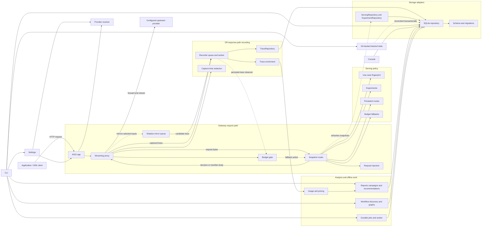

# Architecture

`ctrlrtn` is one local process with two deliberately different halves:

- The **data plane** forwards provider requests and streams responses. It does
  only the work required to route, protect an experiment, and capture a trace.
- The **control plane** reads recorded traces to report spend, evaluate models,
  manage experiments, and install explicit routes.

The project favors direct functions and immutable data over framework layers.
SQLite, `httpx`, and Starlette are the main runtime building blocks.

## Request flow

```text
client request
    |
    v
Starlette app -> upstream resolver -> serving decision -> streaming proxy
                  |                    |                    |
                  |                    v                    v
                  |       experiment / route / pass-through
                  |                                         |
                  |                                         v
                  |                              recorder queue -> SQLite
                  v
       provider + base URL + stripped path + API identity + pricing policy
```

## Component map



Solid arrows describe ordinary request, data, and control flow. The dashed paths
are asynchronous snapshot refresh, off-response-path mirroring,
persisted-accounting observation, control-state reconciliation, or budget
fallback control; none introduces a database read while deciding a request.

Note the direction of the storage edges: the gateway depends on the repository
contracts in `recorder/repositories.py`, never on the SQLite adapter, and
nothing under `recorder/` depends on `gateway/`. `ServingRepository` is
deliberately free of mutators, so the request path cannot perform a
control-plane write even by mistake.

Serving precedence is:

```text
running experiment > step route > workflow route > use-case route > pass-through
```

A running experiment owns its use-case's traffic split; a route on the same
use-case stays dormant until the experiment stops. Workflow and step routes
match only a complete, validated workflow identity, described in
[workflow-identity.md](workflow-identity.md).

Cache-control injection composes with that decision and is gated by the
resolved API identity, not guessed from the URL. The proxy records the client's
original path and body plus the provider, its pricing policy, and the model
actually served, so enrichment and historical re-enrichment remain honest. A
named mount affects transport only; the same body keeps the same use-case
fingerprint across providers. A decision may also name another configured
provider: the proxy switches transport only when the candidate's API identity
exactly matches the baseline's, removes credential headers and
credential-named query parameters whenever the provider changes, and injects a
provider-owned credential from the environment only while forwarding. An
unknown provider or API mismatch terminates locally and is recorded; there is
no request or response translation between APIs.

## Code map

- `gateway/` is the request path. `app.py` wires the ASGI lifecycle, the
  `/healthz` probe, and the local `/ctrlrtn/` control-plane endpoints.
  `proxy/` owns byte forwarding: `handler.py` orchestrates decisions and
  transport, `headers.py` credential-safe forwarding, `recording.py` streaming
  and synthetic trace capture, `models.py` the hook contracts and terminal
  error. `serving.py` refreshes experiment and route snapshots and applies
  them per request; `decision.py` is the small contract between serving
  policies and the proxy. `shadow.py` mirrors selected inputs off the response
  path through a separate HTTP pool and bounded worker queue; actual and
  candidate traces share a pair id and durable counters expose completed,
  failed, and dropped mirrors. `inject.py` mutates the outbound request;
  `redact.py` strips credentials from the URL forwarded upstream. The at-rest
  guarantee is separate: `recorder/redaction.py` owns what may reach the
  database.
- `config/` is the runtime-settings surface. `models.py` owns immutable
  settings and configuration errors; `schema.py` owns scalar defaults and
  coercion; `providers.py` and `budgets.py` parse structured policy;
  `sources.py` reads the YAML and environment layers; `loader.py` applies
  precedence and assembles the final settings value.
- `routing.py` resolves a client path to a provider identity, base URL, and
  provider-facing path. Named mounts are stripped here.
- `identify/fingerprint.py` derives the use-case key every experiment, route,
  and report shares: `tag:<name>` from `x-ctrlrtn-route`, else `fp:<digest>`
  over the request's structure (system prompt, tool schemas, response format)
  with generic dates and times normalized away.
- `policy/` contains budget admission (`budget.py`) plus the immutable
  experiment, route, fallback, and shadow primitives the gateway consults per
  request, and `scope.py`, the workflow-step scope they share.
- `control_config/` is the Git-backed desired-state surface. `models.py` owns
  immutable documents and revision provenance; `parser.py` validates YAML into
  policy objects; `rendering.py` owns canonical serialization, live snapshots,
  and active-versus-desired diffs; `provenance.py` proves a clean tracked Git
  revision.
- `control/service.py` plans interactive route and experiment-adoption changes
  once for both the CLI and the console. Storage applies adoption as one
  transaction, so a failed route write cannot leave the experiment stopped.
- `recorder/` persists traces off the response path. `recorder.py` is the
  queue and background worker; `trace.py` the trace record; `models.py` store
  result values and sentinel names; `redaction.py` capture-time credential
  redaction. `repositories.py` names storage contracts by capability, so a
  caller asks for the authority it needs: `ServingRepository` (hot-path reads,
  no mutators), `ShadowRepository`, `ReportingRepository`, `TraceRepository`,
  `ExperimentRepository`; `protocols.py` composes the whole-store contracts
  from them. Gateway code depends on these, never on SQLite.

  The SQLite store, `recorder/sqlite/store.py`, is composed from capability
  mixins (traces, workflow, jobs, control, maintenance, reporting) over a typed
  base, `recorder/sqlite/capability.py`. The base declares the shared
  connection attributes and the abstract methods the mixins call on `self`;
  each abstract method is implemented by exactly one mixin, so a composition
  that leaves one out fails at class creation and mypy reports it. The
  in-memory store, `recorder/memory_store.py`, mirrors that shape:
  `recorder/memory/core.py` declares the shared state and the mixins under
  `recorder/memory/` implement each capability. `recorder/sqlite/schema.py`
  owns tables, indexes, triggers, and in-place column upgrades; `queries.py`
  and `results.py` hold shared SQL and result values. Module boundaries never
  split a transaction: atomic multi-table operations run as one method on the
  shared connection.
- `telemetry/` derives model, token, and cost data from recorded traffic:
  `enrich.py`, `usage.py`, `pricing.py`, and the `prices.toml` default table.
- `analysis/` builds recommendations, propagation checks, campaign summaries,
  and reports from recorded data. Nothing here sits on the request path.
- `eval/` contains pure evaluation and statistics code (`ni.py`,
  `tripwire.py`, `judge.py`, `calibration.py`, `replay.py`,
  `dataset_manifest.py`) plus the one isolated live HTTP adapter, `live.py`.
- `sdk/` is the client-instrumentation surface: `context.py` owns task, route,
  and workflow propagation; `http.py` httpx request stamping; `lifecycle.py`
  the edition, step, and tool-operation context managers; `reporting.py`
  gateway event transport; `dispatch.py` a small late-bound seam that keeps
  reporting hooks replaceable without coupling lifecycle state to transport.
- `workflow/` derives workflow identity from request headers (`identity.py`,
  `tool_operation.py`), computes step metrics and per-task graphs
  (`metrics.py`, `graph.py`, `step_detail.py`, `catalog.py`), correlates tool
  calls into inferred edges (`inference.py`), discovers recurring families in
  undeclared task traffic (`discovery/`, `discovery_job/`,
  `discovery_projection.py`, `proposal.py`), and derives advisory
  recommendations (`recommend.py`, `tool_batching.py`). All of it is
  analysis-only.
- `jobs/` owns durable background execution. `models.py` contains lifecycle
  state, `context.py` cooperative progress and cancellation, `worker.py`
  claim, heartbeat, and terminal transitions, and `replay.py` offline replay
  as one injected handler.
- `cli/` is the terminal edge. `commands.py` is the composition root: it
  resolves shared dependencies, builds the parser, and normalizes domain
  errors. `parser.py` assembles the parser from `arguments/`, which registers
  arguments by command family; the adapters mirror those families:
  `runtime.py` (gateway and console startup), `operations.py` (workers, jobs,
  maintenance), `reporting.py` (recorded-traffic views), `dataset.py`,
  `evaluation/` (tripwire status, replay, calibration, campaign reports),
  `control.py` (experiments, shadows, routes, routing config, fallbacks), and
  `workflow/` (inference, discovery, inspection). `render.py` holds shared
  presentation. Domain decisions stay below these thin I/O adapters.
  `cli/__init__.py` is deliberately empty: Python runs a package's initializer
  before any submodule, so code there would make importing a pure renderer
  load the whole gateway. `console.py` starts the Textual console and `tui/`
  separates the app shell, forms and screens, read-model state, formatting,
  table and detail presentation, the investigation view, and workflow and
  control actions. The monitor's persistent connection is read-only; confirmed
  actions open a short-lived writer and leave gateway activation to the normal
  snapshot refresh.

## Dependency rules

1. The proxy must not perform database or network-control-plane reads while
   deciding how to serve a request. Serving reads in-memory snapshots.
2. Domain modules do not import the CLI, console, Starlette app, or SQLite.
3. Code that only needs stored values or a persistence interface imports
   `recorder.models` or `recorder.repositories`, not the SQLite implementation.
   Ask for the narrowest contract that fits: `ServingRepository` declares no
   mutators, so a hot-path component cannot perform a control-plane write.
4. Package dependencies run one way: `gateway/` and `cli/` may depend on
   `policy/`, `recorder/`, `telemetry/`, and `workflow/`; none of those may
   depend on `gateway/` or `cli/`. Storage never imports the HTTP edge. When a
   helper is needed by both, it belongs to whichever side owns the guarantee,
   which is why capture-time redaction lives under `recorder/` and
   forward-time credential stripping under `gateway/`.
5. Provider HTTP calls used by evaluations stay in `eval/live.py`; statistical
   functions accept injected callables and remain offline-testable.
6. Resources are owned explicitly. The application closes clients and stores it
   creates and leaves injected resources to their caller.
7. Provider-specific request mutations are selected by the resolved API
   identity. A coincidentally similar path is not sufficient.
8. Provider pricing policy is captured on the trace at request time. Historical
   re-enrichment must not depend on the router's current configuration.
9. Cross-provider serving is allowed only between equal, explicit API
   identities. Supporting different APIs requires a separately designed
   translation boundary and is not inferred from model names.
10. Budget admission reads an in-memory snapshot: UTC-day global and use-case
    totals plus lifetime totals and unknown-cost state per session. SQLite
    seeds it at startup and the recorder updates it only after persistence; no
    database I/O occurs on the request path. Optional in-flight reservations
    are owned by the same gate and reconciled only after enriched persistence.
11. Router-imposed budget rejections are ordinary non-blocking synthetic traces,
    including outside experiments. Operational budget reporting groups their
    terminal reasons from SQLite; telemetry loss is preferable to delaying a
    client response when the recorder queue is saturated.
12. Budget fallbacks are durable approvals derived only from a `NON_INFERIOR`
    replay artifact. Admission emits a fallback action at an explicit lower
    use-case threshold; the snapshot router applies it only to the evaluated
    baseline and never overrides an experiment or route. The hard ceiling is
    checked again after rewriting and remains a shutoff.
13. The budget CLI and live console share one renderer and the same read-only
    SQLite queries. Both report persisted accounting only; process-local
    reservations remain deliberately outside this cross-process view.

## Persistence

SQLite is the durable source for traces, outcomes, workflow lifecycle and
tool-operation events, inferred edges, experiments, routes, workflow routes
and definitions, shadow experiments, approved fallbacks, durable jobs, and the
active routing-config revision. Workflow identity is extracted off-path during
enrichment into dedicated trace columns; malformed partial sets become
diagnostics rather than routable identity. Lifecycle event IDs are idempotent,
and consistency queries expose reused run IDs, cross-task dependencies, and
contradictory terminal states. One connection is protected by a lock and
blocking operations run outside the event loop. Schema changes are additive,
so an existing database opens in place. Successful fallback calls carry a
separate trace fact; they are forwarded calls, not terminal rejections.

The console's monitoring connection opens the database with SQLite's
read-only URI. It cannot create the file, run DDL, or take a write lock, and it
still sees every WAL commit from the live gateway.

Git-backed control state is reconciled in one transaction that records
repository HEAD, relative path, file digest, and activation time. Serving
matches only explicit validated headers, records the winning rule and
revision on every routed trace, and never consults observed or inferred graph
projections.

Everything `workflow/` derives is a projection. `inference.py` persists its
exact tool-ID matches, with versioned evidence hashes and source trace
provenance, in a table separate from explicit lifecycle facts; no data-plane
module reads it. `discovery_job/` freezes exact trace IDs, evidence digests,
and the immutable scope in the normal job ledger, where queued and running
references protect those payloads from pruning; its checksummed result holds
family assignments and metrics without trace IDs or bodies, and retention
records source invalidation separately instead of rewriting a completed
artifact. `metrics.py`, `graph.py`, `discovery_projection.py`, and
`recommend.py` are recomputed from retained rows at query time and consume
explicit identities and lifecycle events, never task outcomes or inferred
edges. `policy/scope.py` is the one shared exact workflow-step selector used
by offline replay, online shadow, and live split; scoped tripwires consume
explicit step lifecycle outcomes rather than task outcomes.

## Deliberate limits

- The recommended deployment is one process on the same host as the client.
- Live task counters and ceilings are process-local; durable measurement comes
  from recorded traces.
- Spend ceilings are eventually consistent and may overshoot by work already in
  flight by default. Opt-in reservations account for a conservative request
  estimate during admission and close the same-process concurrency race, but
  they are not a shared or exact provider billing ledger.
- Session enforcement loads every persisted session ID into process memory and
  assumes IDs are unique and short-lived. Retention or a compact aggregate table
  is required before treating this as an unbounded multi-tenant ledger.
- Requests and streamed responses are retained in memory for full recording.
  Bounded capture or disk spooling belongs in a later change, justified by a
  measured workload.
- Provider-specific request translation is not generalized. An adapter boundary
  belongs where a second provider needs the same mutation operation.
- The router observes and routes; it never reorders, merges, retries, or
  parallelizes application steps. The header and event contract that keeps
  observation separate from orchestration is in
  [workflow-identity.md](workflow-identity.md).
