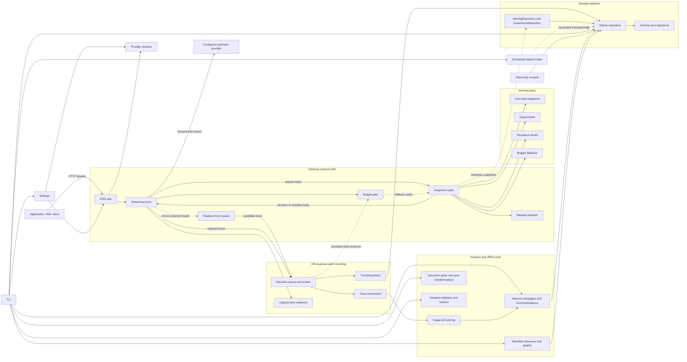

# Architecture

`ctrlrtn` is one local process with two deliberately different halves:

- The **data plane** forwards provider requests and streams responses. It does
  only work required to route, protect an experiment, and capture a trace.
- The **control plane** reads recorded traces to report spend, evaluate models,
  manage experiments, and install explicit routes.

The project favors direct functions and immutable data over framework layers.
SQLite, `httpx`, and Starlette are the main runtime building blocks.

## Request flow

```text
client request
    |
    v
Starlette app -> upstream resolver -> serving decision -> streaming proxy
                  |                    |                    |
                  |                    v                    v
                  |       experiment / route / pass-through
                  |                                         |
                  |                                         v
                  |                              recorder queue -> SQLite
                  v
       provider + base URL + stripped path + API identity + pricing policy
```

## Component map



Solid arrows describe ordinary request, data, and control flow. The dashed paths
are asynchronous snapshot refresh, off-response-path mirroring,
persisted-accounting observation, control-state reconciliation, or budget
fallback control; none introduces a database read while deciding a request.

Note the direction of the storage edges: the gateway depends on the repository
contracts in `recorder/repositories.py`, never on the SQLite adapter, and
nothing under `recorder/` depends on `gateway/`. `ServingRepository` is
deliberately free of mutators, so the request path cannot perform a
control-plane write even by mistake.

Serving precedence is:

```text
running experiment > persistent route > pass-through
```

Cache-control injection composes with that decision and is gated by the
resolved API identity, not guessed from the URL. The proxy records the client's
original path and body plus the provider, its pricing policy, and the model
actually served, so enrichment and historical re-enrichment remain honest. A
named mount affects transport only; the same body keeps the same use-case
fingerprint across providers.

A serving decision may also name another configured provider. The proxy resolves
that name after model selection and changes transport only when the candidate's
API identity exactly matches the baseline's. The provider-facing path and query
are retained, except that credential headers and credential-named query
parameters are removed whenever the provider changes. An unknown provider or
API mismatch terminates locally and is recorded; request/response translation
is outside this slice. A provider may instead own a credential named in
configuration; the proxy reads it from the environment only while forwarding,
after removing all client credential carriers.

## Code map

- `gateway/app.py` wires the ASGI lifecycle and local control-plane endpoints.
- `gateway/proxy/` owns byte forwarding behind a stable facade. `handler.py`
  orchestrates decisions and transport, `headers.py` owns credential-safe
  forwarding, `recording.py` owns streaming and synthetic trace capture, and
  `models.py` owns the hook contracts and terminal error.
- `gateway/serving.py` refreshes experiment/route snapshots and applies them.
- `gateway/shadow.py` mirrors selected inputs off the response path through a
  separate HTTP pool and bounded worker queue. Actual/candidate traces share a
  pair id; durable counters expose completed, failed, and dropped mirrors.
- `gateway/decision.py` is the small contract between serving policies and the
  proxy.
- `gateway/inject.py` mutates the outbound request; `gateway/redact.py`
  strips credentials from the URL forwarded upstream. The at-rest guarantee
  is separate: `recorder/redaction.py` owns what may reach the database.
- `config/` is the stable runtime-settings surface. `models.py` owns immutable
  settings and configuration errors; `schema.py` owns scalar defaults and
  coercion; `providers.py` and `budgets.py` parse structured policy; `sources.py`
  reads YAML and environment layers; and `loader.py` applies precedence and
  assembles the final settings value. Its package initializer only re-exports
  the original public API.
- `routing.py` resolves a client path to a provider identity, base URL, and
  provider-facing path. Named mounts are stripped here.
- `policy/` contains budget admission plus the immutable experiment, route,
  fallback, and shadow primitives the gateway consults per request, and
  `policy/scope.py`, the workflow scope they share.
- `control_config/` is the stable Git-backed desired-state surface. `models.py`
  owns immutable documents and revision provenance; `parser.py` validates YAML
  into policy objects; `rendering.py` owns canonical serialization, live
  snapshots, and active-versus-desired diffs; and `provenance.py` proves a clean
  tracked Git revision. SQLite reconciles that state transactionally and records
  its revision provenance. The package initializer only preserves the original
  public API.
- `control/service.py` plans interactive route and experiment-adoption changes
  once for both CLI and TUI. Storage applies adoption as one transaction, so a
  failed route write cannot leave the experiment stopped.
- `recorder/recorder.py` moves persistence off the response path.
- `recorder/models.py` contains store result values and sentinel names.
- `recorder/repositories.py` names storage contracts by capability, so a
  caller asks for the authority it needs: `ServingRepository` (hot-path reads,
  no mutators), `ShadowRepository`, `ReportingRepository`, `TraceRepository`,
  `ExperimentRepository`. `recorder/protocols.py` composes the whole-store
  contracts from them. Gateway code depends on these, never on SQLite.
- `recorder/memory_store.py` is the stable test/development facade, composed
  from `recorder/memory/` capabilities for core writes, workflow observations,
  reporting, and control state.
- `recorder/sqlite/schema.py` owns table, index, and trigger creation plus
  in-place column upgrades. `recorder/sqlite/store.py` is the stable concrete
  store facade: one connection owner is composed with capability modules for
  trace writes, workflow observations, jobs, control state, maintenance, and
  reporting. The larger workflow, control, and reporting capabilities are
  themselves composed from focused subpackages. Shared declarative SQL and
  result values live in `queries.py` and `results.py`. These boundaries do not
  split a transaction—atomic
  multi-table operations still run as one method on the shared connection.
  `recorder/store.py` preserves the original package-level import surface.
- `telemetry/` derives model, token, and cost data from recorded traffic:
  `enrich.py`, `usage.py`, `pricing.py`, and the `prices.toml` default table.
- `analysis/` builds recommendations, propagation checks, campaign summaries,
  and reports from recorded data. Nothing here sits on the request path.
- `eval/` contains pure evaluation/statistics code plus isolated live HTTP
  adapters.
- `sdk/` is the stable client-instrumentation surface. Its package initializer
  only re-exports capabilities: `context.py` owns task, route, and workflow
  propagation; `http.py` owns httpx request stamping; `lifecycle.py` owns
  edition, step, and tool context managers; and `reporting.py` owns gateway
  event transport. A small late-bound dispatch seam keeps public reporting
  hooks replaceable without coupling lifecycle state to HTTP transport.
- `cli/commands.py` is the composition root: it resolves shared dependencies,
  builds the parser, and normalizes domain errors. `cli/parser.py` preserves the
  original import surface while `cli/arguments/` registers arguments by command
  family. `cli/render.py` contains shared presentation functions.
- The terminal adapters mirror those parser families: `cli/runtime.py` owns
  gateway and console startup; `cli/operations.py` owns workers, jobs, and
  maintenance; `cli/reporting.py` owns recorded-traffic views;
  `cli/evaluation/` composes tripwire status, replay, calibration, and campaign
  command families behind the original import surface;
  `cli/training.py` owns datasets, training authority, and signed trajectory
  adapters; `cli/control.py` owns experiments, shadows, routes, routing config,
  and fallbacks; `cli/execution.py` owns execution-plan, evidence, simulation,
  and canary-key handlers; and `cli/workflow/` composes workflow inference,
  discovery, inspection, visualization, and trajectory-job submission behind
  the original command class. Domain decisions
  stay below these thin I/O adapters. `cli/__init__.py` is deliberately empty:
  Python runs a package's initializer before any submodule, so code there
  would make importing a pure renderer load the whole gateway.
- `cli/console.py` preserves the original Textual import surface while
  `cli/tui/` separates the app shell, modal forms and screens, read-model state,
  formatting, table/detail presentation, and workflow/control/canary actions.
  The larger form, table, and control-action surfaces are stable package
  facades composed from focused form families, refresh/fill/detail table
  capabilities, and shadow/Git/live/route action families.
  The monitor's persistent connection is read-only; confirmed offline-job,
  live-experiment, shadow, and
  route actions open a short-lived writer and leave gateway activation to the
  normal snapshot refresh. Shadow detail joins actual/candidate traces by their
  durable pair id and exposes one-sided attrition. Git-config activation
  previews a desired-state diff and re-verifies revision plus document hash
  immediately before the write.
  An optional second read-only connection monitors the dedicated pure-canary
  ledger. Confirmed canary rollback opens its own short-lived writer and can
  only reduce execution authority; canary state never enters the router DB.
- `workflow/` derives workflow identity from request headers, then discovers
  families, builds graphs, and correlates tool calls from recorded traffic.
- `execution/` holds execution plans, identity, evidence, and the `pure_*`
  transformations that run work without a serving side effect.
- `training/` holds dataset manifests, signed trajectory adapters, and the
  sandboxed trainer process.
- `jobs/` owns durable background execution. `models.py` contains lifecycle
  state, `context.py` owns cooperative progress/cancellation, `worker.py` owns
  claim/heartbeat/terminal transitions, and `replay.py` implements offline
  replay as one injected handler. The package initializer re-exports the
  generic jobs API.
- `local-model-training.md` defines the future offline training boundary. It
  reuses durable jobs and console monitoring but forbids database-controlled
  commands, evaluation materialization, gateway execution, and automatic model
  serving. No trainer or payload exporter is implemented.

## Dependency rules

1. The proxy must not perform database or network-control-plane reads while
   deciding how to serve a request. Serving reads in-memory snapshots.
2. Domain modules do not import the CLI, console, Starlette app, or SQLite.
3. Code that only needs stored values or a persistence interface imports
   `recorder.models` or `recorder.repositories`, not the SQLite implementation.
   Ask for the narrowest contract that fits: `ServingRepository` declares no
   mutators, so a hot-path component cannot perform a control-plane write.
4. Package dependencies run one way: `gateway/` and `cli/` may depend on
   `policy/`, `recorder/`, `telemetry/`, `workflow/`, and `execution/`; none of
   those may depend on `gateway/` or `cli/`. Storage never imports the HTTP
   edge — when a helper is needed by both, it belongs to whichever side owns
   the guarantee, which is why capture-time redaction lives under `recorder/`
   and forward-time credential stripping under `gateway/`.
5. Provider HTTP calls used by evaluations stay in `eval/live.py`; statistical
   functions accept injected callables and remain offline-testable.
6. Resources are owned explicitly. The application closes clients and stores it
   creates and leaves injected resources to their caller.
7. Provider-specific request mutations are selected by the resolved API
   identity. A coincidentally similar path is not sufficient.
8. Provider pricing policy is captured on the trace at request time. Historical
   re-enrichment must not depend on the router's current configuration.
9. Cross-provider serving is allowed only between equal, explicit API
   identities. Supporting different APIs requires a separately designed
   translation boundary and is not inferred from model names.
10. Budget admission reads an in-memory snapshot: UTC-day global/use-case totals
    plus lifetime totals and unknown-cost state per session. SQLite seeds it at
    startup and the recorder updates it only after persistence; no database I/O
    occurs on the request path. Optional in-flight reservations are owned by the
    same gate and reconciled only after enriched persistence.
11. Router-imposed budget rejections are ordinary non-blocking synthetic traces,
    including outside experiments. Operational budget reporting groups their
    terminal reasons from SQLite; telemetry loss is preferable to delaying a
    client response when the recorder queue is saturated.
12. Budget fallbacks are durable approvals derived only from a `NON_INFERIOR`
    replay artifact. Admission emits a fallback action at an explicit lower
    use-case threshold; the snapshot router applies it only to the evaluated
    baseline and never overrides an experiment or route. The hard ceiling is
    checked again after rewriting and remains a shutoff.
13. The budget CLI and live console share one renderer and the same read-only
    SQLite queries. Both report persisted accounting only; process-local
    reservations remain deliberately outside this cross-process view.

## Persistence and compatibility

SQLite is the durable source for traces, outcomes, workflow lifecycle events,
experiments, routes, and approved fallbacks. Workflow identity is extracted
off-path during enrichment into additive trace columns; malformed partial sets
become diagnostics rather than routable identity. Lifecycle event IDs are
idempotent, and consistency queries expose reused run IDs, cross-task
dependencies, and contradictory terminal states. A single connection is
protected by a lock and blocking operations run outside the event loop. Schema
changes append migrations so existing local databases open in place. Successful
fallback calls carry a separate trace fact; they are forwarded calls, not
terminal rejections.

`workflow/discovery/` keeps passive family discovery analysis-only while
separating exact trace correlation, normalized task structures, deterministic
family clustering, and operator rendering behind one stable facade. None of
these modules grants routing or execution authority.

`workflow/inference.py` is an offline projection over stored request/response
bodies. Its exact tool-ID matcher persists versioned evidence hashes and source
trace provenance in a table separate from explicit lifecycle facts. No data-plane
module reads inferred edges. Accuracy is measured against explicit dependency
events, with uninstrumented targets excluded from precision/recall claims.

`workflow/discovery_job/` is the durable boundary for passive family discovery.
Its stable package facade separates shared contracts and scope validation from
submission planning, artifact codecs, worker execution, and snapshot comparison.
Submission freezes exact trace IDs and evidence digests in the normal job ledger;
queued and running references protect those payloads from pruning. The standard
worker revalidates every input, reports bounded clustering progress,
cooperatively observes cancellation, and stores a checksummed analysis-only
result without trace IDs or bodies. Completed results survive restart and remain
ineligible for routing or execution authority.
Versioned results retain per-task-digest family assignments, structural variant,
match score, correlation provenance, ambiguity, and algorithm parameters.
Cross-snapshot comparison uses a deterministic one-to-one structural family
match before comparing stable task digests; family IDs alone are not treated as
lineage. Version 4 scopes snapshots by complete task cohorts and makes the scope
relationship an explicit comparison input. Comparisons across multiple changed
dimensions fail closed unless an operator deliberately overrides the guard.
Version 5 adds indexed, bounded cohort selection with a frozen denominator
report. Retention protects active samples and records source invalidation
separately for completed immutable artifacts, preserving audit history without
claiming stale results remain reproducible.

`workflow/metrics.py` is the pure attribution boundary for stable-step metrics.
`workflow/graph.py` is the read-only per-task projection boundary. It combines
explicit lifecycle identities and trace metrics with separately persisted
inference, retaining edge provenance for console timelines and Mermaid export.
No graph projection is read by routing or imported as workflow authority.

`workflow/discovery_projection.py` is the passive-family projection boundary.
It runs on the frozen, verified discovery input, aggregates only digested family
membership, and persists metrics and structural summaries in the checksummed
result. Its text, Mermaid, and JSON renderers are observability outputs and have
no execution or routing reader.

`control_config.py` is also the authority boundary for declared workflow
shapes and exact-version workflow/step routes. It validates committed YAML
before an atomic SQLite activation. Serving matches only explicit validated
headers, records the winning rule and revision, and never consults observed or
inferred graph projections.

`policy/scope.py` defines the shared exact workflow-step selector used by
offline replay, online shadow, and live traffic split. Scoped traffic requires
all of workflow, version, and step to match explicit request identity. Scoped
tripwires consume explicit step lifecycle outcomes rather than task outcomes.

`workflow/recommend.py` is a pure advisory projection over explicit step
metrics and committed descriptive definitions. Its scenario benefits,
confidence, and hazard lists are display data only and have no data-plane or
orchestration reader.
It consumes explicit trace identities and lifecycle events, never task outcomes
or inferred edges. Identity collisions are excluded; contradictory terminal
states and missing step outcomes remain visible denominators.

Execution transformations are deliberately outside this process. The accepted
[execution transformation design](execution-transformations.md) defines a
separate optional executor that an application must call explicitly. The
gateway has no executor import, scheduling authority, or runtime dependency, and
this repository does not yet implement that executor. Observed graphs and
recommendations cannot be promoted into executable plans.

`execution/plan.py` is the first implemented part of that future boundary. It is
a pure, proposed-only YAML parser and eligibility explainer. It has no gateway,
SQLite, provider, Git, scheduler, or activation dependency; its CLI commands
only read a local file and print a result.

`execution/simulator/` exercises the proposed state machine with static local
fixtures. Its stable facade separates strict scenario parsing, fixture-only
adapters, dedicated persistence, state-machine orchestration, and rendering. It
persists provenance, attempts, cancellation, invariants, and an append-only
transition history to a dedicated SQLite file so another process can inspect
progress. Its adapter types contain only fixture lookup and expose no provider,
network, tool, human, gateway, activation, or router-database path.

`execution/pure_parallel.py` is an application-imported development primitive for declared
pure cooperative callables. It requires explicit opt-in, an exact local
fail-closed gate, a shared process-local rollout admission controller, and the
application's original orchestration fallback. It has no CLI, gateway, provider,
configuration activation, or persistence reader. Its counters and audit events
are not durable, so it is not a production canary or promotion boundary.

`execution/evidence.py` validates paired complete baseline/candidate trajectory
suites and seals deterministic exact-output comparisons as canonical JSON. A
separate offline approval binds the exact plan and evidence digests and is
semantically revalidated on read. No serving, gateway, simulator, or parallel
execution module imports this evidence, so approval has no activation effect.

`execution/pure_shadow/` is the first approval reader, but only for background
pure-work comparison. Its stable facade separates contracts, deterministic
selection, dedicated audit storage, and bounded worker orchestration. It calls
no provider and serves no candidate result. A bounded queue and dedicated
SQLite audit store expose completion, mismatch, failure, drop, cancellation,
and restart interruption without involving gateway shadow state.

`execution/pure_canary.py` is the stable public facade for a distinct explicit
activation authority derived from a clean shadow snapshot. `execution/canary/`
separates canonical authority creation and verification, audited signer-key
state, ledger connection/schema ownership, campaign admission and fencing,
read-only inspection, and fail-closed runner orchestration. The store composes
key and campaign capabilities over one dedicated connection, so registration,
rotation, admission, rollback, and fencing transactions are not fragmented by
the module split. The lifecycle remains application-owned and pure-step-only.
Its dedicated SQLite ledger uses transactional admission for whole-run sampling
and conservative task, cost, and concurrency bounds. Failures atomically close
new candidate admission; the gateway does not import or operate this lifecycle.
Canary authority is Ed25519-authenticated with a role-bound operator key by
default; named caller-managed HMAC keys remain an explicit legacy drain mode.
Authority binds the plan/evidence/approval digests recorded by the shadow store. The ledger
elects one renewable owner instance and fences every run with its epoch, so a
stale process cannot commit completion or affect a successor campaign owner.
The ledger persists non-secret rollout and last-known-good metadata for
separate-process monitoring. Its read-only reader has no activation API; the
console's emergency rollback increments the fence and invalidates unfinished
rows atomically.
Non-secret canary key trust state lives in the same dedicated ledger: active key
IDs, bounded overlap retirement, immediate revocation, and an append-only
hash-chained operator event log. Key bytes remain caller-owned. Runners combine
cryptographic verification with a fresh ledger trust check on every admission.

The proposed remote boundary is specified separately in
[execution-identity-protocol.md](execution-identity-protocol.md). It requires
Ed25519 HTTP Message Signatures, exact application/workflow/version/plan grants,
and durable single-use request identities before a dedicated executor can admit
work. Application keys and operator keys have disjoint roles. This is a design
contract only: the gateway and current local canary API do not implement or
accept the protocol.

`execution/identity.py` implements only the protocol's pure verification
boundary. It validates role-bound Ed25519 public-key records, operator-signed
exact grants, the constrained HTTP Message Signature profile, canonical request
bodies, and exact authorization matching. It returns inert verified values and
imports no server, gateway, SQLite, provider, or execution module. Durable
nonce consumption is separate, and any remote endpoint remains unimplemented.

`execution/nonce.py` is the dedicated durable replay boundary. A SQLite primary
key atomically consumes `(app_id, request_id)` and binds it to the verified body,
grant, campaign, and one operation ID. Identical retries reuse that operation;
altered retries fail. Terminal response digests are immutable. Retention can be
extended but not shortened, and compaction replaces terminal detail with a
permanent minimal tombstone so an old request never becomes fresh. In-progress
rows survive restart and are never automatically reclaimed. This provides
multi-process safety within one SQLite locking domain, not multi-host consensus.
Schema creation is explicit; normal opens fail if the state file or schema is
missing, so storage loss cannot silently reset replay history. No endpoint or
gateway imports the store.

`execution/remote_executor.py` is the opt-in application-owned ASGI boundary. It requires
HTTPS and the exact configured authority, resolves live public-key and grant
snapshots, runs the pure verifier, consumes the nonce, and only then invokes a
`PureCanaryExecutionAdapter`. The adapter supplies pure operations and the
original fallback from application-owned runtime closures; credentials do not
enter the signed body or durable nonce state. Result release follows durable
terminal recording. The gateway neither imports nor mounts this application,
and there is no generic provider proxy or configuration-only activation path.

Canary activation now has two deliberately separate signature modes. Ed25519
operator decisions are the default production path: the approval binds the
operator principal and signer ID, while the ledger binds that ID to an audited
operator role, algorithm, and public-key fingerprint. Both bindings are checked
on every admission. Legacy HMAC verification is disabled unless the embedding
application explicitly enables compatibility mode; old artifacts cannot be
reinterpreted or upgraded in place. Operator rotation preserves principal and
cannot downgrade to an unbound key.

`recorder.store` is a compatibility facade. New internal code should import a
model, protocol, or concrete store directly; external callers can keep using the
old imports.

## Deliberate limits

- The recommended deployment is one process on the same host as the client.
- Live task counters and ceilings are process-local; durable measurement comes
  from recorded traces.
- Spend ceilings are eventually consistent and may overshoot by work already in
  flight by default. Opt-in reservations account for a conservative request
  estimate during admission and close the same-process concurrency race, but
  they are not a shared or exact provider billing ledger.
- Session enforcement loads every persisted session ID into process memory and
  assumes IDs are unique and short-lived. Retention or a compact aggregate table
  is required before treating this as an unbounded multi-tenant ledger.
- Requests and streamed responses are currently retained in memory for full
  recording. Introduce bounded capture or disk spooling only when measured
  workloads justify that complexity.
- Provider-specific request translation is not generalized prematurely. Add an
  adapter boundary when a second provider needs the same mutation operation.

The original product and statistical design discussions are retained under
`docs/history/`. They explain why decisions were made, but this file and the
runtime documentation describe the current structure.

The accepted identity and propagation contract for the next agentic-workflow
slice is in [workflow-identity.md](workflow-identity.md). It deliberately keeps
workflow observation and routing separate from execution/orchestration.
