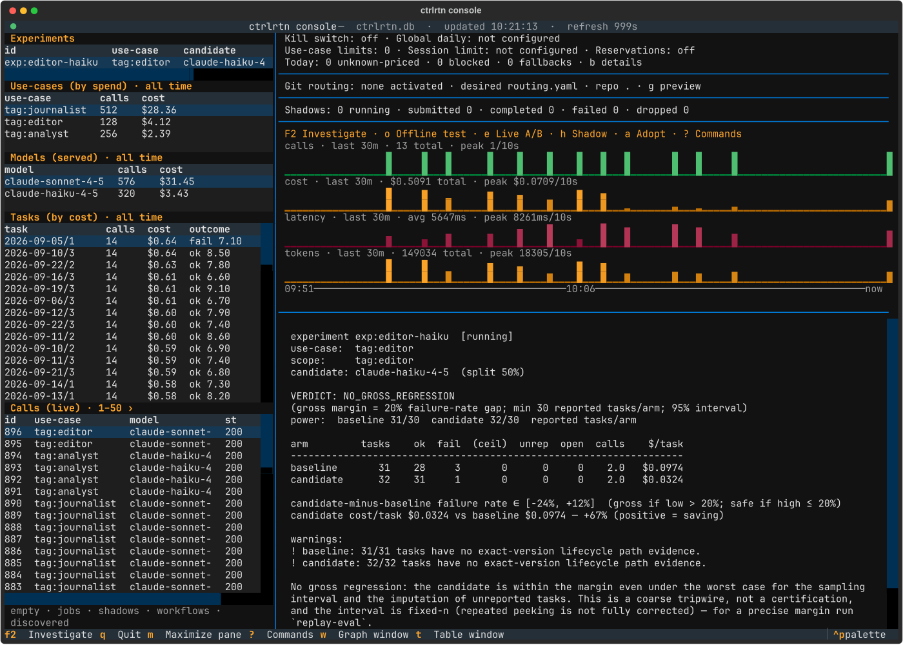

# Console

`ctrlrtn console` is a live terminal UI over the `serve` database: durable
jobs, experiments, shadows, use-cases, spend split by the model actually
served, workflows, tasks, and a `tail -f` call feed, with traffic graphs and a
detail pane. It monitors over a read-only connection and runs control actions
only after a confirmation preview.



The picture is rendered from a synthetic recording by
`scripts/console_screenshot.py`, so nothing in it is real traffic.

## Install and launch

The console needs the `tui` extra (Textual):

```bash
uv sync --extra tui        # or: pip install -e ".[tui]"
uv run ctrlrtn console
```

| Flag | Effect |
| --- | --- |
| `--refresh SECONDS` | Seconds between reads (default 3). |
| `--routing-config PATH` | Desired Git-backed routing file used by `g` (default `./routing.yaml`). |
| `--routing-repo DIR` | Git repository containing `--routing-config` (default `.`). |

It reads the same config as `serve` (`CTRLRTN_CONFIG`, else `./ctrlrtn.yaml`),
so run it from the same directory or use an absolute `db_path`. Over SSH, use
`ssh -t`.

## What the screen shows

- **Sidebar tables**: Jobs, Experiments, Shadows, Use-cases, Models (served),
  Workflows, Discovered workflows, Tasks (by cost), and Calls (live). A list
  with no rows collapses to one `empty · ...` line and the others share the
  height in proportion to what they hold; the focused list always stays
  visible.
- **Status lines**: budget status (compact by default), the active Git routing
  revision, shadow counters, and the experiment shortcuts.
- **Graphs**: calls, cost, latency, and tokens over one shared time axis that
  marks the window's start, midpoint, and `now`. Each caption carries the
  window, the total, and the peak bucket with its width (`peak 12/10s`).
- **Detail pane**: the focused table's highlighted row in full. It shows
  tripwire verdicts with their `route adopt` recommendation, per-use-case model
  breakdowns with route savings, a shadow's latest actual/candidate pair with
  any one-sided attrition, a workflow's per-task timeline and aggregate flow,
  the routing rule and revision that served a call, and full traces.
- **Header**: `updated HH:MM:SS · refresh 3s` dates the last successful read.
  The icon beside the title is the status light: green while reads land, red
  with `STALE since ...` once one fails. The timestamp stays put while stale.
- **Footer**: a handful of keys; `?` or `F1` opens the full command panel.

The use-case, model, and task tables span all recorded history by default and
carry their own window, picked with `t`. Graphs default to the last 30 minutes,
picked with `w`; both pickers offer `10m`, `30m`, `1h`, `6h`, `12h`, `1d`,
`7d`, and `all`. Jobs, experiments, shadows, and workflows are lifecycle lists
and are never windowed. Jobs, workflows, and the call feed page 50 rows at a
time with `[` and `]`; the heading shows the range (`Calls (live) · ‹ 51–100 ›`).
Paging off the newest page pauses the feed's tail; returning to page 1 resumes
it.

## Keys

Letter keys ignore shift. Every dialog closes on `esc`, walks its fields with
the arrow keys, and completes as you type: use-cases from recorded traffic,
models from the price table plus anything actually served. Anything typed is
accepted, since a candidate you have never run is the normal case.

| Group | Key | Action |
| --- | --- | --- |
| Monitor | `F2` | Open the investigation view |
| | `q` | Quit |
| | `r` | Refresh now |
| | `m` | Maximize the focused pane |
| | `enter` | Expand the selected row's detail to the full right-hand column |
| | `esc` | Back: out of an expanded detail first, then out of a maximized pane |
| | `ctrl+d` / `ctrl+u` | Page the detail pane down / up from anywhere |
| | `?` / `F1` | Toggle the command panel |
| View | `w` | Graph window |
| | `t` | Table window |
| | `b` | Expand or collapse budget diagnostics |
| | `[` / `]` | Previous / next page of the focused list |
| Experiments | `o` | New offline replay eval (queued for `ctrlrtn worker`) |
| | `e` | New live A/B split |
| | `h` | New shadow |
| | `s` | Stop the focused A/B |
| | `z` | Stop the focused shadow |
| | `a` | Adopt the focused experiment's candidate as its 100% route |
| Routing | `p` | Set or change the focused use-case's route |
| | `c` | Clear the focused use-case's route |
| | `g` | Git config: preview and activate `routing.yaml` |
| | `x` | Cancel the focused job |
| Workflows | `d` | Step drill-down for the focused workflow |
| | `l` | Open the focused discovered family's DAG |
| | `u` | Discover workflows (freeze default inputs, queue a job) |
| | `f` | Scoped discovery dialog |
| | `i` | Identify: write an inert proposal for the focused family |
| | `y` | Verify an identification proposal file |
| | `j` | Compare the focused discovery job with the previous snapshot |

`tab` reaches the detail scroller in the normal layout without expanding it.
Arrow keys, page keys, and home/end scroll whichever pane has focus.

## Confirmation before every write

The long-lived monitoring connection is read-only. Every traffic-changing
action (`e`, `h`, `s`, `z`, `a`, `p`, `c`, `g`) and every job action that
spends or cancels (`o`, `x`) shows a confirmation preview first, then opens a
short-lived control-plane writer for that one operation. The write lands in
the same local SQLite state the CLI uses and takes effect on the gateway's
next snapshot refresh, normally within about 10 seconds. Workflow actions use
narrow writes and never touch routing: `u` freezes default inputs and queues a
discovery job at once, `f` and `i` open a form and write on submit, and a
proposal file must not already exist. Discovery and replay jobs are queued,
not run, by the console; run `ctrlrtn worker` to execute them and watch
progress, cancellation, and results in Jobs.

## Investigation view (`F2`)

`F2` opens the current table window in a focused, read-only view with four
sections: `1` overview, `2` full-width role costs, `3` task completion, and
`4` a comparison built from attached replay evidence. `c` cycles the comparison
mode, `i` inspects the selected calls, `r` refreshes, and `esc` returns to the
monitor. Select a role or task to inspect its chronological calls. The view
keeps unknown costs and missing or conflicting outcomes visible; it reads at
most the latest 10,000 eligible calls and labels the totals partial when it
hits that cap.

## Git routing activation (`g`)

The status bar shows the active Git routing revision. `g` validates the file
named by `--routing-config` inside `--routing-repo`, requires it to be tracked,
committed, and clean, and opens a scrollable active-versus-desired diff. After
confirmation the revision and document hash are checked again; if the file
changed while the preview was open, activation is refused. The activation is
the same atomic transaction as `ctrlrtn routing-config activate`. The console
never fetches, pulls, pushes, commits, or resolves conflicts; see
[configure.md](configure.md) for the file format.
